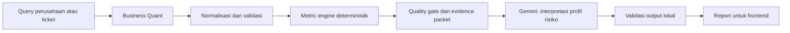

# StockFrame

**Riset saham. Pahami perusahaannya.**

StockFrame adalah alat bantu riset ekuitas yang menggabungkan data perusahaan, metrik finansial deterministik, konteks pasar, dan interpretasi AI dalam satu alur yang dapat ditelusuri. StockFrame bukan platform transaksi dan bukan nasihat investasi personal.

## Cara kerja



Perhitungan angka dilakukan oleh backend TypeScript. Gemini hanya menafsirkan metrik dan evidence yang diberikan; model tidak mengambil data provider, tidak menghitung ulang canonical metrics, dan tidak menggantikan quality gate.

## Fitur utama

- Resolusi nama perusahaan dan ticker melalui universe Business Quant.
- Profil perusahaan, laporan income statement, balance sheet, cash flow, harga EOD, dan corporate actions terstruktur.
- Metrik finansial deterministik dengan status ketersediaan, unit, warning, formula ID, dan evidence ID.
- Quality gate untuk membedakan data `sufficient`, `degraded`, dan `insufficient`.
- Tiga perspektif interpretasi risiko: konservatif, moderat, dan agresif.
- Evidence dan provenance agar klaim dapat ditelusuri kembali ke data yang digunakan.
- Grafik harga historis, metrik utama, kualitas data, corporate actions, dan batasan analisis.
- UI responsif dengan arah visual **Black Frame / Lime Signal**, focus state, skip link, dan dukungan reduced motion.

## Teknologi

- Next.js 16.2.9 dengan App Router
- React 19.2.7
- TypeScript 5.9.3
- Zod untuk validasi kontrak
- Business Quant sebagai market-data provider
- Gemini API langsung sebagai AI provider
- Motion untuk interaksi dan loading state
- Visx dan D3 untuk visualisasi chart
- Vitest dan ESLint untuk validasi lokal

## Prasyarat

- Node.js `22.16.0`
- npm `10.9.2`
- API key Business Quant
- API key Gemini dan satu model Gemini GA yang tersedia di akun tersebut

Versi Node dan npm yang disarankan juga tercantum di `.nvmrc`, `.node-version`, dan `package.json`.

## Menjalankan secara lokal

1. Pasang dependency:

   ```powershell
   npm install
   ```

2. Salin template environment:

   ```powershell
   Copy-Item .env.example .env.local
   ```

3. Isi nilai environment di `.env.local`:

   ```text
   BUSINESS_QUANT_API_KEY=
   GEMINI_API_KEY=
   GEMINI_MODEL_ID=
   ```

4. Jalankan development server:

   ```powershell
   npm run dev
   ```

   Buka [http://localhost:3000](http://localhost:3000).

Semua key provider wajib berada di server. Jangan commit `.env.local`, menaruh key di frontend, atau mencatat credential pada log.

## Script yang tersedia

| Script | Fungsi |
| --- | --- |
| `npm run dev` | Menjalankan development server |
| `npm run build` | Membuat production build |
| `npm run lint` | Menjalankan ESLint |
| `npm run typecheck` | Memeriksa tipe TypeScript tanpa emit |
| `npm run test` | Menjalankan seluruh test Vitest |

## API analisis

Endpoint publik utama:

```text
POST /api/analyze
Content-Type: application/json
```

Contoh request:

```json
{
  "query": "AAPL",
  "focus": "Periksa fundamental, valuasi, dan risiko utama"
}
```

`query` menerima ticker atau nama perusahaan yang sudah di-trim. `focus` bersifat opsional dan membatasi arah riset. Response sukses membawa `requestId`, identitas instrument, snapshot, metrics, quality, dan report. Error untuk client tetap typed dan generik; detail internal provider, prompt, raw payload, dan credential tidak dikirim ke browser.

## Batas provider dan data

Untuk ticker yang belum tercache, pipeline Business Quant menggunakan paling banyak enam panggilan market-data: universe tidak dihitung dalam batas tersebut, lalu profile, income statement, balance sheet, cash flow, harga EOD, dan corporate actions. Cache memiliki TTL dan ukuran terbatas.

Corporate actions diperlakukan sebagai event terstruktur, bukan berita. Event yang tidak dikenal dipetakan ke `other` dengan warning aman. Data harga tidak diubah otomatis untuk split, dan price return tidak diklaim sebagai total shareholder return.

Raw payload provider tidak diteruskan ke Gemini. Request provider memiliki timeout, `AbortSignal`, typed error, redacted logging, dan retry transient yang terbatas; HTTP 429 tidak di-retry.

Jika quality gate menghasilkan `insufficient`, pipeline berhenti sebelum panggilan Gemini. Data `degraded` dapat dilanjutkan dengan batasan dan confidence yang lebih rendah.

## Metrik canonical

Engine saat ini mencakup:

`der`, `current_ratio`, `roa`, `roe`, `eps_ttm`, `pe`, `book_value_per_share`, `pbv`, `gross_margin`, `operating_margin`, `net_margin`, `free_cash_flow`, `fcf_margin`, `roic`, `price_return`, dan `volatility`.

Nilai metric, formula, status, warning, dan evidence ditetapkan oleh engine. AI hanya menghasilkan interpretasi yang merujuk pada ID metric/evidence yang tersedia.

## Struktur proyek

```text
app/                  Route Next.js dan halaman utama
components/charts/    Komponen visualisasi chart
lib/ai/               Prompt, adapter Gemini, schema, dan validasi report
lib/domain/           Kontrak domain dan schema publik
lib/market-data/      Provider Business Quant dan normalizer
lib/metrics/          Formula serta kalkulasi metric
lib/presentation/     Policy dan view model presentasi
lib/quality/          Quality gate dan evidence packet
lib/server/           Service analisis dan rate limit
tests/                Fixture serta unit/integration tests
docs/                 Spesifikasi dan implementation plan
checklists/           Checklist milestone
devlog/               Catatan pengembangan append-only
```

## Dokumentasi

- [Backend specification](docs/BACKEND_SPEC.md)
- [Backend implementation plan](docs/BACKEND_IMPLEMENTATION_PLAN.md)
- [Frontend specification](docs/FRONTEND_SPEC.md)
- [Frontend implementation plan](docs/FRONTEND_IMPLEMENTATION_PLAN.md)
- [Milestone checklists](checklists/)

## Batasan penggunaan

StockFrame membantu membaca data dan alasan di balik kesimpulan. Hasilnya tidak menjamin kinerja masa depan, bukan rekomendasi beli/jual, dan tidak mengeksekusi transaksi. Ketersediaan serta kelengkapan report tetap bergantung pada data provider, kualitas snapshot, dan validasi output model.
