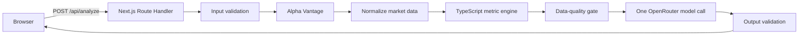

# AI Trading Research Server Specification

Status: Revised implementation specification  
Date: 2026-08-05  
Scope: server-side analysis logic hosted with the web application  
Out of scope: frontend UI/UX, brokerage execution, portfolio management, and personalized financial advice

## 1. Product objective

The application turns market and company data into a structured AI-assisted equity research report. The application calculates financial metrics deterministically and uses one configured AI model to interpret those values. The model does not fetch market data, execute tools, debate with other models, or replace canonical calculations.

The initial workflow is:

1. The user submits a company or ticker and an optional research focus.
2. The server resolves the supported instrument and fetches market data from Alpha Vantage.
3. TypeScript normalizes the provider response and calculates financial metrics.
4. The server applies deterministic data-quality checks.
5. One OpenRouter model receives a bounded evidence packet in one request.
6. The model returns one structured report containing conservative, moderate, and aggressive perspectives.
7. The server validates the response and returns it directly to the browser.

The product provides educational research. It does not execute trades, manage funds, determine position size, or guarantee returns.

## 2. Locked architecture decisions

| Concern | Decision |
|---|---|
| Application framework | Next.js App Router |
| Language | TypeScript |
| Frontend | React inside the same Next.js project |
| Server boundary | Next.js Route Handlers running as Vercel Functions |
| Market data | Alpha Vantage |
| AI gateway | OpenRouter |
| AI execution | One explicit model and one model call per successful analysis |
| Financial calculations | Pure TypeScript functions |
| Hosting | One Vercel project |
| Persistence | None required for the initial version |
| Authentication | None required for the initial version |
| Request model | Synchronous `POST /api/analyze` |
| Secrets | Vercel server-side environment variables |

The initial version does not require Python, FastAPI, Uvicorn, Azure, Docker, a separate backend service, Supabase, a queue, a background runner, multi-agent orchestration, AI debate, AI tool-calling, or model memory.

“No separate backend” means there is no independently deployed backend server. Sensitive work still runs server-side in a Route Handler so provider keys never enter the browser bundle.

## 3. System architecture



All stages execute within one server request. No analysis job is created and the frontend does not poll for progress. The UI may show local stage labels while waiting, but those labels are presentation state rather than persisted server state.

## 4. Initial product boundaries

Included:

- US-listed common stocks supported by Alpha Vantage.
- Company-name or ticker input with explicit ambiguity handling.
- Latest available market and financial data.
- Indonesian report output by default.
- Deterministic financial metrics and data-quality warnings.
- One final report with conservative, moderate, and aggressive perspectives.
- One server-side AI call per completed analysis.
- Fixture-based tests that do not consume provider quota.
- Deployment as one Next.js project on Vercel.

Deferred:

- User accounts, saved history, shared reports, and database persistence.
- Multiple AI models, debate, review loops, consensus, and autonomous tools.
- Background processing, queues, cancellation, retry jobs, and progress polling.
- News and sentiment feeds as required inputs.
- ETFs, non-US exchanges, crypto, forex, options, and brokerage integration.
- Historical date selection, backtesting, portfolio analysis, and position sizing.
- Production-scale abuse prevention, distributed rate limiting, and paid infrastructure.

## 5. Request and response contract

### 5.1 Request

`POST /api/analyze`

```json
{
  "query": "AAPL",
  "focus": "Periksa fundamental, valuasi, dan risiko utama"
}
```

Rules:

- `query` is trimmed and limited to 1-100 characters.
- `focus` is optional, trimmed, and limited to 500 characters.
- Empty input, unsupported symbols, and ambiguous company matches return typed client errors.
- The request body has a strict size limit.

### 5.2 Successful response

```json
{
  "requestId": "uuid",
  "instrument": {},
  "snapshot": {},
  "metrics": [],
  "quality": {},
  "report": {
    "summary": "...",
    "strengths": [],
    "risks": [],
    "limitations": [],
    "profiles": {
      "conservative": {},
      "moderate": {},
      "aggressive": {}
    },
    "disclaimer": "..."
  }
}
```

### 5.3 Error response

```json
{
  "requestId": "uuid",
  "error": {
    "code": "PROVIDER_RATE_LIMITED",
    "message": "Data pasar sedang tidak tersedia. Coba lagi nanti.",
    "retryable": true
  }
}
```

Internal provider messages, stack traces, prompts, and credentials must never be returned.

## 6. Domain contracts

Domain contracts are plain TypeScript types and schemas independent of React components and provider SDKs.

| Contract | Responsibility |
|---|---|
| `AnalysisRequest` | Validated user query and focus |
| `Instrument` | Canonical ticker, company name, exchange, currency, and region |
| `Evidence` | Stable ID, source, effective date, and value reference |
| `Metric` | Canonical value, unit, formula ID, status, warnings, and evidence IDs |
| `MarketSnapshot` | Normalized point-in-time market and financial data |
| `QualityAssessment` | Deterministic score, flags, and AI eligibility |
| `ProfileRecommendation` | One risk-profile perspective and rating |
| `FinalReport` | Validated analysis containing exactly three profiles |
| `AnalyzeResponse` | Public response returned by the Route Handler |

Required enums or unions:

- `RiskProfile`: `conservative`, `moderate`, `aggressive`
- `Rating`: `positive`, `neutral`, `negative`
- `MetricStatus`: `available`, `not_available`, `not_meaningful`
- `QualityFlag`
- `ErrorCode`

Required version constants:

- domain schema version;
- market snapshot version;
- metric-policy version;
- AI prompt version;
- report schema version.

Equivalent structured inputs use deterministic serialization and SHA-256 hashing where stable identity is needed for tests, evidence, and future caching.

## 7. Instrument resolution

Resolution behavior:

1. Normalize user input without altering a plausible ticker.
2. If it matches the supported ticker format, verify it against provider data.
3. Otherwise use Alpha Vantage symbol search.
4. Filter unsupported regions and instrument types.
5. Continue only for one strong match.
6. Return explicit candidates when the input remains ambiguous.

The server must never silently select a company when multiple plausible matches remain.

## 8. Market-data acquisition

The minimum useful snapshot may consume:

- symbol search when needed;
- latest quote or compact daily prices;
- company overview;
- income statement;
- balance sheet;
- cash-flow statement.

Provider rules:

- API keys are read only from server-side environment variables.
- Provider URLs and function names are fixed by the adapter.
- Every call has an abort timeout.
- Retry at most once for a transient network or server failure.
- Do not immediately retry a provider rate-limit response.
- Distinguish invalid key, quota exceeded, symbol not found, timeout, malformed payload, and upstream failure.
- Never log complete request URLs when they contain provider credentials.
- Never send complete raw provider payloads to OpenRouter.
- Provider quota assumptions are configurable and are not hard-coded to a specific commercial plan.

The initial implementation may reuse a completed result in the current browser session. Durable cross-user caching is deferred until persistence is actually needed.

## 9. Normalization and evidence

Normalization must:

- parse numeric strings into finite numbers;
- map provider placeholders and unsupported values to `null`;
- retain currency, fiscal period, and effective date;
- sort and deduplicate periods;
- select the latest valid rows without look-ahead data;
- reject currency-incompatible calculations;
- assign stable evidence IDs;
- prevent `NaN` and infinity from entering JSON.

Every metric references the evidence used to calculate it. The final AI report may cite only evidence IDs included in the packet.

## 10. Deterministic metric engine

The AI never supplies or replaces canonical metric values.

| Metric | Formula |
|---|---|
| EPS TTM | Sum of the latest four valid quarterly diluted EPS values |
| P/E | Effective close / EPS TTM |
| Book value per share | Total equity / diluted shares |
| P/BV | Effective close / book value per share |
| DER | Total liabilities / total equity |
| Current ratio | Current assets / current liabilities |
| Gross margin | TTM gross profit / TTM revenue |
| Operating margin | TTM operating income / TTM revenue |
| Net margin | TTM net income / TTM revenue |
| ROA | TTM net income / average total assets |
| ROE | TTM net income / average total equity |
| ROIC | NOPAT / average operating invested capital, where operating invested capital = total assets - total current liabilities |
| Free cash flow | Operating cash flow - capital expenditure |
| FCF margin | TTM free cash flow / TTM revenue |
| Price return | Latest close / comparison close - 1 |
| Volatility | Annualized standard deviation of daily returns |

`ROI` is represented by clearly named measures such as ROIC and price return. `EAR` remains excluded until its intended definition is confirmed.

Invalid calculation rules:

- a zero denominator returns `null`;
- negative equity marks affected metrics as not meaningful;
- negative EPS makes P/E not meaningful;
- partial TTM data is explicitly flagged;
- insufficient prices disable return or volatility metrics;
- currency mismatch returns `null` with a warning.

## 11. Data-quality gate

The server derives a deterministic quality assessment from source completeness, freshness, statement consistency, and metric availability.

| Result | Behavior |
|---|---|
| Insufficient | Stop before OpenRouter and return `INSUFFICIENT_DATA` |
| Degraded | Continue, disclose limitations, and cap confidence |
| Sufficient | Continue with the full output contract |

The model may explain quality flags but cannot remove or override them.

## 12. Single-model AI analysis

One explicit OpenRouter model ID is configured server-side. A successful analysis makes exactly one model request.

The evidence packet contains only:

- resolved instrument identity;
- effective date;
- normalized company facts needed for interpretation;
- canonical metrics and statuses;
- quality flags;
- user focus delimited as untrusted text;
- known evidence IDs;
- required output schema and policy instructions.

The model returns:

- executive summary;
- fundamental and valuation interpretation;
- strengths, risks, uncertainties, and limitations;
- exactly one conservative perspective;
- exactly one moderate perspective;
- exactly one aggressive perspective;
- citations using known evidence IDs;
- educational disclaimer.

The three perspectives are sections of one report, not separate AI agents or separate requests.

Output validation must reject:

- malformed JSON;
- missing or duplicate profiles;
- unsupported ratings;
- confidence outside its bounds;
- unknown evidence IDs;
- model-generated canonical metric replacements;
- personalized trade sizes or guaranteed-return language.

Malformed or schema-invalid model output fails the request with a safe typed error. The server does not perform an automatic repair call, keeping the one-request AI contract explicit.

## 13. Route Handler behavior

`POST /api/analyze` performs:

1. request ID creation;
2. request-size and schema validation;
3. a lightweight per-instance rate-limit check;
4. instrument resolution;
5. market-data retrieval;
6. normalization and metric calculation;
7. data-quality assessment;
8. one OpenRouter analysis request;
9. final-report validation;
10. safe response serialization.

The handler uses the Node.js runtime, not the Edge runtime, unless all dependencies and time limits are explicitly verified. The request must remain within the configured Vercel Function duration. Every external call has a shorter timeout so the handler can return a controlled error before platform termination.

## 14. Security and privacy

Required controls:

- `ALPHA_VANTAGE_API_KEY` and `OPENROUTER_API_KEY` are server-only variables and never use the `NEXT_PUBLIC_` prefix;
- no provider or AI call is made directly from a Client Component;
- fixed provider origins and methods;
- strict input and output schemas;
- prompt delimiters around all user and provider text;
- no secrets, authorization headers, raw prompts, or provider query strings in logs;
- generic client-facing errors with typed internal causes;
- request body and text-length limits;
- bounded provider calls, model tokens, timeouts, and retries;
- a disclaimer in every successful report.

Client-side throttling is not a security control. The first version may use lightweight per-instance throttling for accidental repetition, but stronger public abuse protection requires a durable rate-limit store or platform protection and is deferred.

## 15. Configuration contract

Required server-side environment variables:

```text
ALPHA_VANTAGE_API_KEY
OPENROUTER_API_KEY
OPENROUTER_MODEL_ID
```

Optional configuration:

```text
ANALYSIS_OUTPUT_LANGUAGE=id
MARKET_DATA_TIMEOUT_MS
OPENROUTER_TIMEOUT_MS
OPENROUTER_MAX_TOKENS
ANALYZE_MAX_DURATION_SECONDS
```

Local values live in `.env.local`, which must be ignored by Git. Hosted values are configured in Vercel. Startup or request initialization fails safely when required configuration is missing.

## 16. Project structure

```text
app/
  api/
    analyze/
      route.ts
  ...frontend routes
lib/
  domain/
  market-data/
  metrics/
  quality/
  ai/
  server/
tests/
  fixtures/
  unit/
  integration/
checklists/
```

Server-only modules must not be imported by Client Components. Provider adapters, secrets, and OpenRouter code remain below `lib/server` or explicitly use `server-only` boundaries.

## 17. Testing strategy

Required automated coverage:

- request validation and typed errors;
- instrument resolution and ambiguity;
- provider fixture parsing and malformed responses;
- every metric formula and invalid-calculation rule;
- deterministic quality decisions;
- deterministic evidence-packet construction;
- valid and invalid model outputs;
- exactly three risk profiles;
- unknown evidence rejection;
- Route Handler success and failure contracts;
- secret-redaction checks;
- proof that normal success uses one model request.

Default tests use fixtures and fake model responses. Live Alpha Vantage and OpenRouter checks are opt-in and never run in normal CI.

## 18. Deployment

The complete application deploys as one Vercel project. The deployment must verify:

- the Next.js build succeeds;
- server-only environment variables are configured;
- `/api/analyze` uses the Node.js runtime;
- external timeouts fit inside the Function duration;
- one known fixture-backed analysis passes;
- one controlled live analysis succeeds when provider quota is available;
- no key appears in browser source, response bodies, or logs.

Vercel Hobby can support personal demonstration within its current usage limits. Alpha Vantage and OpenRouter retain their own independent quotas and costs.

## 19. Definition of done

The server-side analysis is complete when:

- one Next.js project contains both UI and server logic;
- no Python, FastAPI, Azure, database, queue, or separate backend is required at runtime;
- a valid company or ticker produces normalized market data and deterministic metrics;
- insufficient data stops before the AI call;
- one configured model produces one schema-valid report with exactly three risk perspectives;
- canonical values originate from TypeScript calculations rather than the model;
- provider and model failures return stable, safe errors;
- tests pass without live network calls;
- the Vercel deployment completes one controlled end-to-end analysis without exposing secrets.

## 20. Extension path

If the product later needs login, history, shared reports, durable caching, or public abuse protection, Supabase or another managed database can be added behind repository interfaces. If analyses later exceed synchronous Function limits, the workflow can move to a durable job system. Neither extension is required for the initial application.
