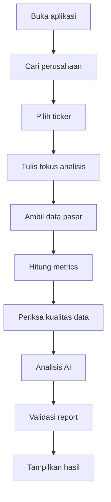
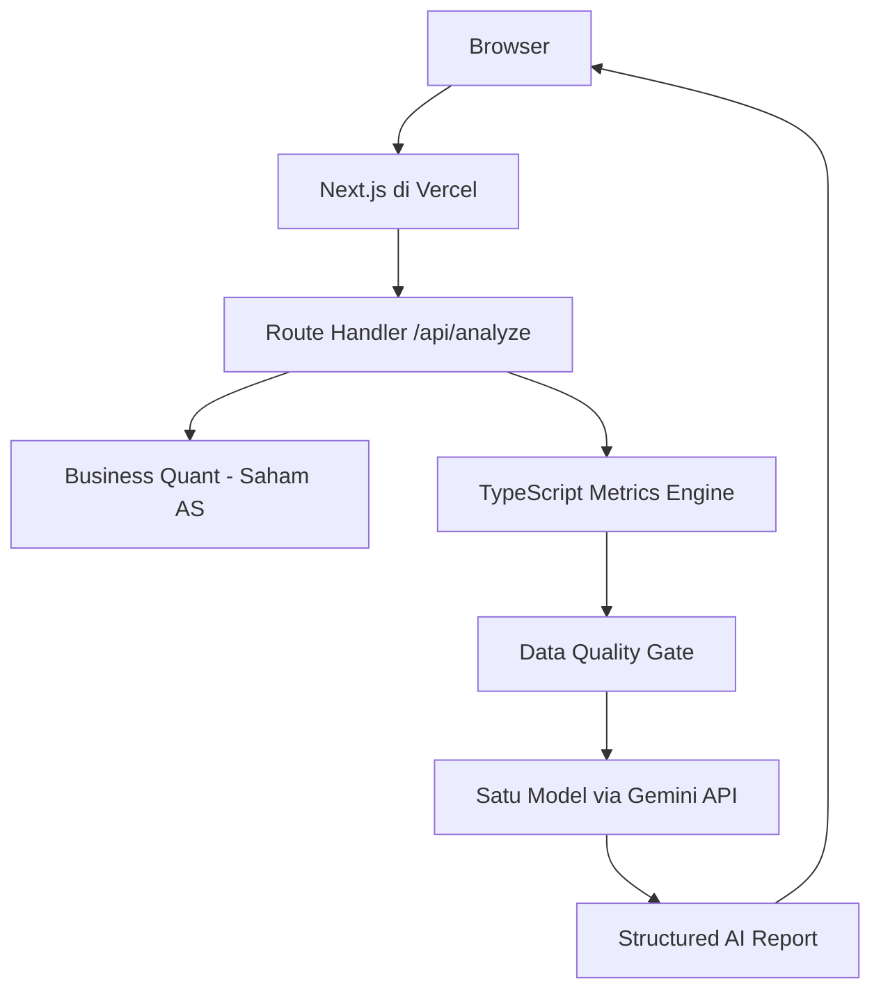
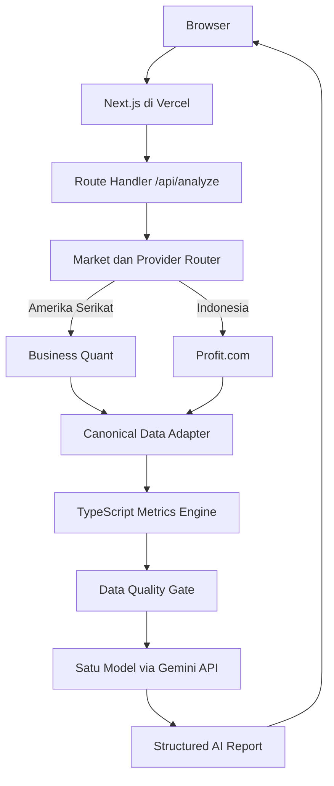

# Proposal Bitsmikro Innovative Vibecode 2026

Nama project: **StockFrame**
Tagline: **Riset saham. Pahami perusahaannya.**

> Identitas tim dan tautan publik dilengkapi sebelum proposal final dikirimkan.

## Informasi Tim

- **Nama Tim:** `[Nama tim]`
- **Nama Project:** StockFrame
- **Kategori:** Mahasiswa
- **Asal Universitas:** Universitas Mikroskil
- **Anggota 1 (Ketua):** `[Nama]`
- **Anggota 2:** `[Nama]`
- **Anggota 3:** `[Nama, jika ada]`

# BAB I - PENDAHULUAN

## 1.1 Latar Belakang

Perkembangan teknologi finansial telah membuat data pasar modal semakin mudah diperoleh. Namun, kemudahan akses tersebut belum selalu diikuti dengan kemampuan pengguna dalam memahami laporan keuangan, indikator pasar, risiko perusahaan, dan hubungan antarmetrik secara menyeluruh. Informasi mengenai suatu perusahaan sering tersebar dalam berbagai sumber dan disajikan dalam bentuk yang sulit dipahami oleh pengguna pemula.

Di sisi lain, penggunaan kecerdasan buatan untuk analisis finansial memiliki tantangan tersendiri. Model AI dapat memberikan penjelasan yang meyakinkan, tetapi berisiko menghasilkan angka atau kesimpulan yang tidak didukung oleh data. Oleh karena itu, dibutuhkan sistem yang memisahkan proses perhitungan finansial dari proses interpretasi AI.

StockFrame dirancang sebagai platform riset saham berbasis web yang menggabungkan data pasar, perhitungan metrik finansial secara deterministik, dan analisis AI terstruktur. Sistem menghitung metrik seperti P/E, DER, ROA, ROE, ROIC, margin laba, free cash flow, price return, dan volatilitas menggunakan TypeScript di sisi server. Satu model AI kemudian menginterpretasikan hasil tersebut dan menyajikannya dalam satu laporan dengan perspektif konservatif, moderat, dan agresif.

## 1.2 Rumusan Masalah

Berdasarkan latar belakang tersebut, rumusan masalah project ini adalah:

1. Bagaimana membantu pengguna memahami kondisi fundamental dan risiko suatu perusahaan tanpa harus membaca data finansial mentah dari berbagai sumber?
2. Bagaimana memanfaatkan AI untuk menginterpretasikan data saham tanpa menyerahkan perhitungan finansial utama kepada AI?
3. Bagaimana menyajikan hasil riset yang relevan bagi pengguna dengan toleransi risiko konservatif, moderat, dan agresif?

## 1.3 Tujuan Project

Tujuan pengembangan StockFrame adalah:

1. Menyediakan platform riset saham yang dapat mengambil, menormalisasi, dan mengolah data perusahaan secara terstruktur.
2. Menghasilkan metrik finansial yang transparan, dapat ditelusuri, dan tidak bergantung pada perhitungan AI.
3. Menggunakan AI untuk menjelaskan data dan menghasilkan laporan riset berdasarkan tiga profil risiko.
4. Membantu pengguna memahami kekuatan, kelemahan, peluang, risiko, dan keterbatasan data perusahaan.

## 1.4 Manfaat Project

1. **Bagi pengguna:** Mempermudah proses memahami kondisi perusahaan melalui laporan yang ringkas, terstruktur, dan berbasis data.
2. **Bagi masyarakat:** Mendukung literasi finansial dan penggunaan AI secara lebih bertanggung jawab dalam bidang investasi.
3. **Bagi pengembang:** Memberikan pengalaman membangun aplikasi full-stack yang mengintegrasikan data finansial, AI, keamanan API, pengujian, dan cloud deployment.

# BAB II - DESKRIPSI PROJECT

## 2.1 Nama Project

- **Nama Project:** StockFrame
- **Tagline:** *Riset saham. Pahami perusahaannya.*

## 2.2 Deskripsi Singkat Project

StockFrame adalah platform riset saham berbasis web yang membantu pengguna memahami kondisi suatu perusahaan melalui data pasar, metrik finansial, dan interpretasi AI. Pengguna cukup memilih perusahaan dan menuliskan aspek yang ingin dianalisis, kemudian sistem menghasilkan laporan terstruktur dengan perspektif konservatif, moderat, dan agresif.

StockFrame tidak melakukan transaksi saham dan tidak memberikan nasihat finansial personal. Hasil yang diberikan bersifat riset dan edukasi.

## 2.3 Gambaran Umum Project

Pengguna memulai analisis dengan mencari nama perusahaan atau ticker saham. Sistem akan menampilkan kandidat yang sesuai agar tidak memilih perusahaan secara ambigu. Setelah perusahaan dipilih, pengguna menuliskan fokus analisis, misalnya valuasi, kemampuan menghasilkan laba, kondisi utang, atau prospek pertumbuhan.

Pada arsitektur utama, Route Handler Next.js mengambil data pasar dan laporan keuangan saham Amerika Serikat melalui Business Quant. Apabila perluasan saham Indonesia berhasil diselesaikan dan divalidasi, sistem juga menggunakan Profit.com melalui provider adapter terpisah. Data dari provider yang aktif kemudian dinormalisasi ke struktur internal yang sama dan digunakan untuk menghitung metrik finansial menggunakan TypeScript. Setiap metrik memiliki formula, status, sumber data, dan peringatan apabila perhitungan tidak dapat dilakukan.

Setelah melewati pemeriksaan kualitas data, sistem mengirimkan paket data terstruktur kepada satu model Gemini melalui Gemini API direct. Satu permintaan AI menghasilkan laporan akhir secara langsung. Perspektif konservatif, moderat, dan agresif merupakan tiga bagian dari laporan yang sama, bukan tiga agen atau tiga permintaan AI terpisah.

Laporan akhir menampilkan ringkasan, analisis fundamental, valuasi, kekuatan perusahaan, risiko, ketidakpastian, keterbatasan data, tingkat keyakinan model, serta tiga perspektif risiko. Perspektif tersebut bukan instruksi beli atau jual, melainkan cara membaca evidence yang sama berdasarkan toleransi risiko berbeda.

## 2.4 Target Pengguna

Target pengguna StockFrame adalah:

- **Mahasiswa dan pelajar:** Pengguna yang ingin mempelajari cara membaca data fundamental perusahaan dan memahami penggunaan AI dalam riset finansial.
- **Investor pemula:** Pengguna yang membutuhkan rangkuman terstruktur sebelum melakukan riset lebih lanjut.
- **Pengajar dan komunitas finansial:** Pihak yang membutuhkan alat bantu edukasi untuk menjelaskan metrik perusahaan dan perbedaan toleransi risiko.

## 2.5 Solusi yang Ditawarkan

StockFrame menawarkan satu alur riset terintegrasi:

1. Menyelesaikan nama perusahaan menjadi ticker yang tepat.
2. Mengambil data pasar dan laporan keuangan.
3. Menormalisasi data dari penyedia eksternal.
4. Menghitung metrik finansial menggunakan formula TypeScript.
5. Menilai kelengkapan dan kualitas data.
6. Menggunakan AI untuk menginterpretasikan data yang telah diverifikasi.
7. Menghasilkan laporan untuk tiga profil risiko.
8. Menampilkan sumber data, peringatan, dan keterbatasan analisis.

Pendekatan ini mengurangi risiko AI mengarang angka karena nilai finansial utama dihitung oleh fungsi server-side. AI hanya digunakan untuk menjelaskan hubungan antardata dan menyusun laporan yang lebih mudah dipahami.

## 2.6 Keunggulan dan Inovasi Project

Keunggulan StockFrame meliputi:

1. **Pemisahan perhitungan dan interpretasi:** Metrik dihitung secara deterministik oleh TypeScript, sedangkan AI hanya melakukan interpretasi.
2. **Tiga profil risiko dari data yang sama:** Satu penelitian menghasilkan sudut pandang konservatif, moderat, dan agresif tanpa mengambil data berulang kali.
3. **AI pipeline yang sederhana dan terkontrol:** Satu model menghasilkan seluruh laporan dalam satu permintaan normal tanpa debat, review loop, atau tool-calling.
4. **Evidence-based report:** Klaim dan metrik terhubung dengan evidence ID serta tanggal efektif data.
5. **Data-quality gate:** Sistem menghentikan analisis AI jika data tidak mencukupi.
6. **Transparansi keterbatasan:** Data kosong, formula yang tidak bermakna, dan tingkat keyakinan ditampilkan kepada pengguna.

# BAB III - PERANCANGAN SISTEM

## 3.1 Analisis Kebutuhan Sistem

### Kebutuhan Fungsional

- Pengguna dapat mencari perusahaan berdasarkan nama atau ticker.
- Sistem menampilkan kandidat apabila perusahaan ambigu.
- Pengguna dapat menuliskan fokus analisis.
- Sistem mengambil market snapshot terbaru.
- Sistem menghitung metrik finansial.
- Sistem melakukan pemeriksaan kualitas data.
- Sistem menggunakan satu model AI untuk menghasilkan laporan terstruktur.
- Sistem menghasilkan tepat tiga perspektif risiko: konservatif, moderat, dan agresif.
- Pengguna menerima status permintaan yang jelas tanpa progress provider yang dibuat-buat.

### Kebutuhan Non-Fungsional

- API key dan credential tidak boleh dikirim ke browser.
- Semua external call memiliki timeout dan retry terbatas.
- Nilai metrik harus dapat direproduksi dari data sumber.
- Sistem harus menolak output AI yang tidak sesuai schema.
- Sistem harus menampilkan error yang mudah dipahami.
- Data sensitif tidak boleh dicatat dalam log.
- Antarmuka harus responsif pada desktop dan perangkat mobile.

## 3.2 Alur Kerja Sistem

1. Pengguna membuka aplikasi.
2. Pengguna mencari nama perusahaan atau ticker.
3. Sistem menampilkan hasil pencarian yang didukung.
4. Pengguna memilih perusahaan dan menuliskan fokus analisis.
5. Route Handler mengambil market snapshot dari provider yang sesuai dengan pasar yang didukung.
6. TypeScript menormalisasi data, menghitung metrik, dan memeriksa kualitas data.
7. Satu model AI menghasilkan laporan berdasarkan data yang telah diverifikasi.
8. Server memvalidasi struktur laporan dan evidence ID.
9. Pengguna melihat laporan serta tiga perspektif risiko.

## 3.3 Arsitektur Sistem

Arsitektur StockFrame disiapkan dalam dua versi agar ruang lingkup project dapat disesuaikan dengan waktu pengembangan. **Versi 1** menjadi arsitektur utama yang wajib selesai dan menggunakan implementasi yang sudah berjalan. **Versi 2** merupakan perluasan dukungan saham Indonesia yang hanya diaktifkan setelah integrasi serta kualitas datanya berhasil divalidasi. Kedua versi tetap menggunakan metrics engine dan pipeline AI yang sama.

### Versi 1 - Arsitektur Utama

Versi 1 mendukung perusahaan yang terdaftar di bursa Amerika Serikat. Frontend dan fungsi server-side berada dalam satu project Next.js. Route Handler menjadi pintu aman untuk mengakses Business Quant dan Gemini tanpa mengirim API key ke browser. Data Business Quant dinormalisasi sebelum digunakan oleh metrics engine. Perhitungan metrik dilakukan dengan TypeScript, sedangkan satu model AI menyusun interpretasi akhir. Seluruh aplikasi di-hosting pada Vercel tanpa server Python terpisah.

Versi ini menjadi batas minimum penyelesaian project karena alur Business Quant, metrics engine, validasi data, dan Gemini telah menjadi fondasi utama StockFrame. Jika waktu pengembangan terbatas atau validasi provider Indonesia belum memenuhi standar, aplikasi tetap dapat dipresentasikan dengan cakupan saham Amerika Serikat yang dinyatakan secara jelas kepada pengguna.

### Versi 2 - Perluasan Saham Indonesia

Versi 2 menambahkan Profit.com sebagai provider untuk perusahaan yang terdaftar di Bursa Efek Indonesia. Pengguna memilih pasar Indonesia atau Amerika Serikat sebelum memilih perusahaan. Market dan Provider Router meneruskan permintaan saham AS ke Business Quant dan permintaan saham Indonesia ke Profit.com.

Respons kedua provider tidak digunakan langsung oleh metrics engine. Setiap respons terlebih dahulu dipetakan oleh **Canonical Data Adapter** ke struktur internal yang sama, meliputi identitas instrumen, mata uang, periode laporan, laporan laba rugi, neraca, arus kas, harga historis, dividen, stock split, dan metadata sumber. Dengan pendekatan ini, formula finansial, data-quality gate, kontrak evidence, serta prompt Gemini tidak perlu dibuat ulang untuk setiap provider.

Profit.com hanya diaktifkan pada aplikasi apabila proof-of-concept terhadap beberapa emiten Indonesia berhasil menunjukkan data fundamental dan harga historis yang lengkap, konsisten, serta menggunakan mata uang dan periode yang benar. Apabila data tidak tersedia atau tidak lolos quality gate, sistem tidak membuat kesimpulan AI dan menampilkan keterbatasan data kepada pengguna. Dengan demikian, perluasan pasar tidak mengurangi transparansi maupun ketepatan arsitektur utama.

## 3.4 Perancangan Antarmuka

Antarmuka StockFrame menggunakan arah visual **Black Frame / Lime Signal**. Pengalaman dibagi menjadi dua mode yang saling terhubung. Bagian pengantar bersifat berani dan persuasif untuk memperkenalkan identitas serta metodologi StockFrame, sedangkan workspace hasil analisis lebih tenang, terstruktur, dan mudah dipindai. Informasi ditampilkan bertahap agar pengguna pemula tidak langsung dibebani seluruh data finansial tanpa menghilangkan evidence bagi pengguna yang membutuhkan detail.

Prinsip desain:

- Hierarki informasi yang jelas.
- Palet near-black, signal lime, deep forest, dan warm white dengan kontras yang mudah dibaca.
- Pemisahan visual yang jelas antara data sumber, hasil engine, interpretasi AI, dan keterbatasan.
- Progressive disclosure untuk metrik detail.
- Status loading yang jujur tanpa mengarang tahapan backend yang tidak dikirim API.
- Penjelasan untuk istilah finansial.
- Warna rating tidak menjadi satu-satunya pembeda.
- Disclaimer dan keterbatasan data ditampilkan dengan jelas.
- Desain responsif untuk desktop dan mobile.
- Grafik historis selalu diberi tanggal, mata uang, dan ringkasan teks aksesibel serta tidak digambarkan sebagai proyeksi.

## 3.5 Tampilan Halaman Aplikasi

Screenshot atau mockup yang disarankan:

1. **Identity dan Introduction**
   - Hero Black Frame / Lime Signal.
   - Manifesto “Bukan menebak harga. Membantu membaca alasannya.”
   - Alur Data → Engine → Interpretasi.
2. **Meja Riset**
   - Pencarian perusahaan atau ticker.
   - Input fokus riset.
   - Loading, ambiguity, dan error yang mudah dipahami.
3. **Laporan Riset**
   - Ringkasan dan interpretasi AI.
   - Grafik harga penutupan sekitar satu tahun.
   - Metrik hasil engine dan visualisasi perbandingan yang valid.
   - Perspektif konservatif, moderat, dan agresif.
   - Corporate Actions, evidence, warning, dan keterbatasan data.

## 3.6 Teknologi yang Digunakan

| Kategori | Teknologi | Keterangan |
|---|---|---|
| Full-stack Framework | Next.js, React, dan TypeScript | Frontend serta Route Handler dalam satu project |
| Styling dan Design System | CSS custom | Implementasi identitas Black Frame / Lime Signal dan responsive layout tanpa template generik |
| Visualisasi Data | Bklit UI berbasis Visx | Shared chart foundation untuk ilustrasi signal line, grafik harga historis, tooltip, marker Corporate Actions, dan perbandingan metrik yang kompatibel |
| Server-side API | Next.js Route Handlers | Menjaga API key, mengatur workflow, dan memvalidasi respons |
| Financial Engine | TypeScript | Normalisasi data dan perhitungan metrik deterministik |
| Market Data | Business Quant; Profit.com sebagai perluasan opsional | Business Quant untuk saham AS dan Profit.com untuk saham Indonesia setelah validasi |
| AI/LLM | Gemini API direct | API menuju satu model Gemini GA |
| Deployment | Vercel | Hosting frontend dan server-side Functions |
| Version Control | Git dan GitHub | Kolaborasi dan penyimpanan source code |
| Testing | Vitest dan test tooling Next.js | Unit, contract, integration, dan Route Handler test |
| AI Development Tool | Codex | Membantu planning, implementasi, testing, dan dokumentasi |

# BAB IV - PENUTUP

## 4.1 Kesimpulan

StockFrame merupakan platform riset saham yang menggabungkan pengolahan data finansial secara deterministik dengan kemampuan interpretasi AI. Sistem membantu pengguna memahami kondisi perusahaan tanpa menyerahkan perhitungan finansial utama kepada model AI.

Dengan market snapshot, evidence ID, data-quality gate, dan output terstruktur, StockFrame berusaha menghasilkan laporan yang lebih transparan dan dapat ditelusuri. Tiga perspektif risiko membantu pengguna melihat bagaimana data yang sama dapat menghasilkan pertimbangan berbeda berdasarkan toleransi risiko.

## 4.2 Saran dan Pengembangan Selanjutnya

Pengembangan berikutnya dapat mencakup:

1. Penambahan data berita dan sentimen sebagai evidence opsional.
2. Perbandingan performa perusahaan dalam beberapa periode.
3. Penambahan indikator teknikal.
4. Dukungan terhadap ETF dan bursa lain.
5. Export laporan ke PDF.
6. Watchlist dan perbandingan beberapa perusahaan.
7. Penggunaan model AI kedua sebagai reviewer independen.
8. Pemisahan API dan worker ketika jumlah pengguna meningkat.

# DAFTAR PUSTAKA

Daftar pustaka berikut menggunakan format APA edisi ke-7. Referensi CFA Institute digunakan untuk rasio likuiditas, solvabilitas, profitabilitas, ROA, dan ROE; Damodaran, Penman, serta Ross dkk. digunakan untuk metrik valuasi, ROIC, dan arus kas; sedangkan Tsay digunakan untuk return dan volatilitas data harga.

Business Quant. (n.d.). *Business Quant API documentation*. Retrieved August 10, 2026, from https://businessquant.com/docs/api/

CFA Institute. (2026). *Financial analysis techniques*. https://www.cfainstitute.org/insights/professional-learning/refresher-readings/2026/financial-analysis-techniques

Damodaran, A. (2007). *Return on capital (ROC), return on invested capital (ROIC), and return on equity (ROE): Measurement and implications*. Stern School of Business, New York University. https://pages.stern.nyu.edu/~adamodar/pdfiles/papers/returnmeasures.pdf

Damodaran, A. (n.d.). *Financial measures and ratios*. Stern School of Business, New York University. Retrieved August 10, 2026, from https://pages.stern.nyu.edu/~adamodar/New_Home_Page/definitions.html

Google. (n.d.). *Gemini API documentation*. Retrieved August 10, 2026, from https://ai.google.dev/gemini-api/docs

Next.js. (n.d.). *Next.js documentation*. Retrieved August 10, 2026, from https://nextjs.org/docs

Penman, S. H. (2013). *Financial statement analysis and security valuation* (5th ed.). McGraw-Hill Education.

Profit.com. (n.d.). *Data API documentation*. Retrieved August 10, 2026, from https://api.profit.com/

Ross, S. A., Westerfield, R. W., & Jordan, B. D. (2022). *Fundamentals of corporate finance* (13th ed.). McGraw-Hill Education.

Tsay, R. S. (2010). *Analysis of financial time series* (3rd ed.). John Wiley & Sons.

Vercel. (n.d.). *Vercel documentation*. Retrieved August 10, 2026, from https://vercel.com/docs

# LAMPIRAN

## Lampiran 1. Dokumentasi Project

- Screenshot proses development.
- Screenshot pengujian backend dan frontend.
- Screenshot hasil akhir aplikasi.

## Lampiran 2. Link Repository

- **Link:** `[Masukkan link repository public]`
- **Platform:** GitHub
- **Branch utama:** `main`

## Lampiran 3. Link Video Demo Project

- **Link:** `[Masukkan link video]`
- **Platform deployment:** Vercel

## Lampiran 4. Pembagian Tugas Anggota

| No | Nama Anggota | Peran | Tugas Detail |
|---:|---|---|---|
| 1 | `[Ketua]` | Server-side Developer | Domain, Route Handler, market data, metrics, AI pipeline, testing, dan deployment |
| 2 | `[Anggota 2]` | Frontend Developer | Implementasi halaman, API integration, responsive layout, dan frontend testing |
| 3 | `[Anggota 3]` | UI/UX dan Frontend | Design system, user flow, komponen, accessibility, dan dokumentasi visual |

## Lampiran 5. Link Prompting AI

Dokumen ini berisi kumpulan prompt yang digunakan selama proses Vibecoding dan development project.

- **Link:** `[Masukkan link dokumen prompt dan development log]`

## Lampiran 6. Link Postingan Media Sosial Instagram

- **Link:** `[Masukkan link postingan]`
- **Username Instagram:** `@[username]`
